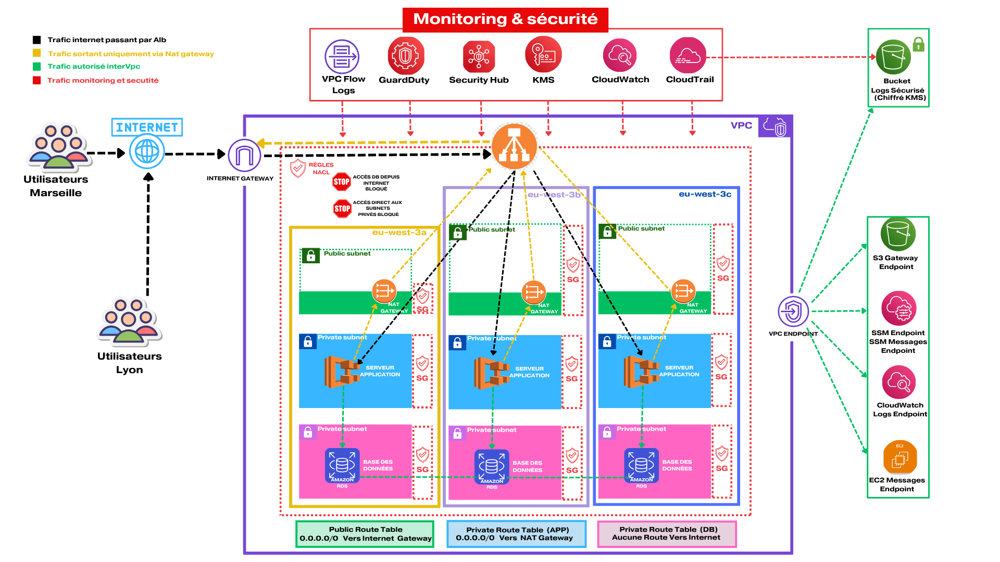

# Nova Syndicate — AWS Cloud Security Architecture

## Overview

Nova Syndicate is a fictional logistics company handling sensitive medical, aerospace, and defense-related components.

This project demonstrates the design and deployment of a secure AWS cloud infrastructure following enterprise security best practices and AWS Well-Architected principles.

The objective is to build a resilient, segmented, monitored, and secure cloud environment using Infrastructure as Code (IaC) with AWS CloudFormation.

---

# Sprint 1 — Secure Foundation

## Implemented Components

### Network Architecture

* Multi-AZ VPC architecture
* Public Subnets
* Private Application Subnets
* Private Database Subnets
* Internet Gateway
* NAT Gateway
* Route Tables
* Security Groups
* NACL segmentation

### Security & Monitoring

* AWS KMS encryption
* AWS CloudTrail
* VPC Flow Logs
* CloudWatch Logs
* GuardDuty
* Security Hub
* Secure S3 logging bucket
* Centralized monitoring architecture

### Private AWS Access

* S3 Gateway Endpoint
* SSM Endpoint
* EC2 Messages Endpoint
* SSM Messages Endpoint
* CloudWatch Logs Endpoint

---

# Security Objectives

This architecture was designed with the following security principles:

* Zero Trust network segmentation
* No direct internet access to workloads
* Private database isolation
* Centralized logging and auditability
* Reduced attack surface
* Encrypted logs and storage
* Secure private communication with AWS services

---

# Architecture Diagram

---

# Traffic Flow

Internet → Application Load Balancer → Private Application Layer → Private Database Layer

Private workloads access AWS services through VPC Endpoints instead of public internet connectivity.

---

# AWS Services Used

* Amazon VPC
* AWS CloudFormation
* Amazon EC2
* Amazon RDS PostgreSQL
* AWS CloudTrail
* Amazon CloudWatch
* AWS KMS
* Amazon S3
* AWS Security Hub
* Amazon GuardDuty
* AWS IAM
* VPC Endpoints

---

# Infrastructure as Code

All resources are deployed using AWS CloudFormation templates.

Current templates:

* 01-network-foundation.yaml
* 02-security-iam-kms.yaml
* 03-logging-monitoring.yaml
* 05-vpc-endpoints.yaml
* 06-security-groups.yaml

---

# Upcoming Sprint

## Sprint 2 — Compute Layer

Next implementation steps:

* Application Load Balancer
* Private EC2 instances
* RDS PostgreSQL
* Auto Scaling
* SSM Session Manager
* Hardened IAM Roles
* Secure application deployment

---

# Author

Lionel Mpata

AWS Certified Solutions Architect – Associate
Cloud Security & AWS Architecture Enthusiast
